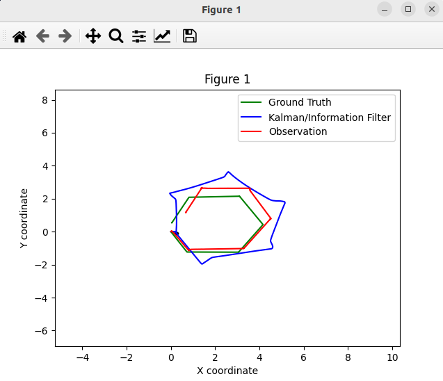
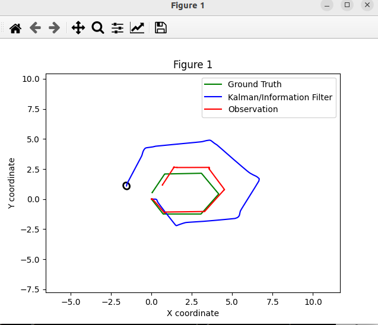
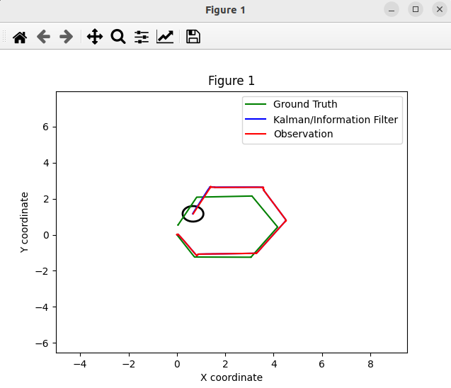
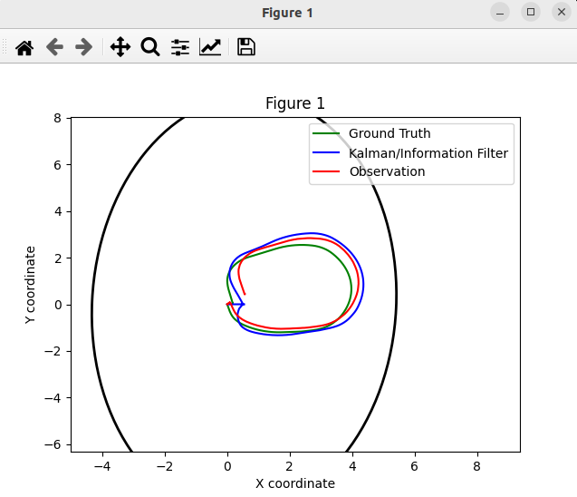
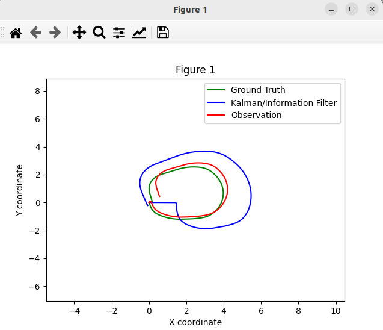
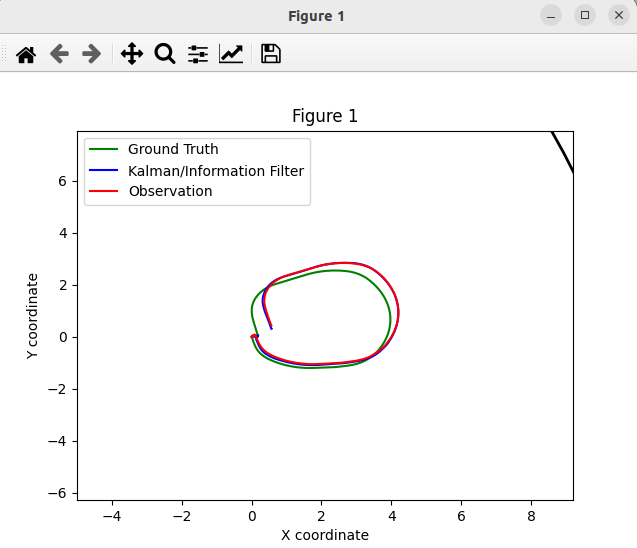
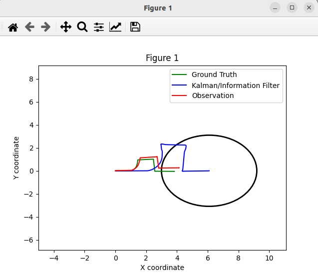
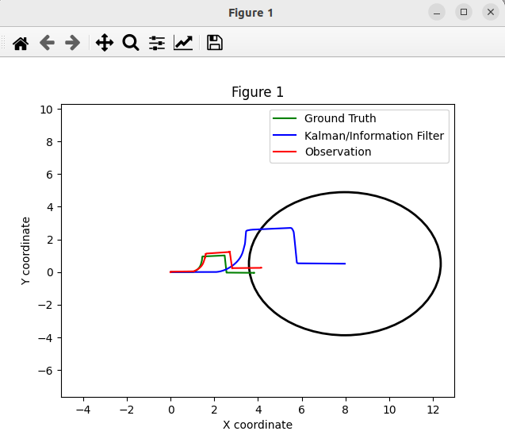
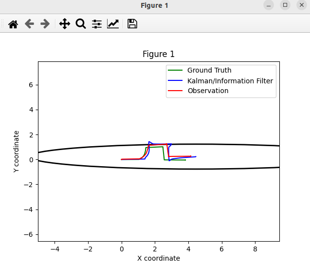

# p3_ekf_rlc

A continuación se muestran los resultados de las distintas conficuraciones que pueden ser modificadas dentro de los scripts: "p3_ekf_adr/ekf_3d_state_estimation.py", "p3_ekf_adr/ekf_7d_state_estimation.py" y "p3_ekf_adr/ekf_8d_state_estimation.py".

En concreto se cambiará la variable  noise_case = "..." por las siguientes opciones:

- "base": caso de un ruido moderado tanto en la observación como en el del modelo
- "alta_observacion": ruido más alto en el las observaciones y un ruido moderado en el modelo
- "alto_modelo": ruido más alto en el modelo y moderado en las observaciones

## Modelo 3D (hex_path)

Se reproduce el bag dentro de la ruta: "bags/hex_path" para cada una de las configuraciones:

| Caso base | Alta incertidumbre en la observación | Alta incertidumbre en el modelo de movimiento |
|:---------:|:------------------------------------:|:---------------------------------------------:|
|  |  |  |

## Modelo 7D (circle_path)

Se reproduce el bag dentro de la ruta: "bags/circle_path" para cada una de las configuraciones:

| Caso base | Alta incertidumbre en la observación | Alta incertidumbre en el modelo de movimiento |
|:---------:|:------------------------------------:|:---------------------------------------------:|
|  |  |  |

## Modelo 8d (default_path)

Se reproduce el bag dentro de la ruta: "bags/default_path" para cada una de las configuraciones:

| Caso base | Alta incertidumbre en la observación | Alta incertidumbre en el modelo de movimiento |
|:---------:|:------------------------------------:|:---------------------------------------------:|
|  |  |  |

